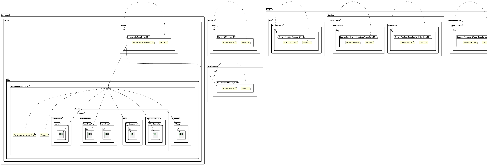

# Описание проекта

Данный проект представляет собой инструмент для работы с пакетами NuGet, включающий возможности загрузки пакетов, анализа их зависимостей и визуализации связей в формате PlantUML. Программа также позволяет генерировать графы зависимостей и преобразовывать их в графические файлы формата PNG.

---

## Функционал и особенности

### Основные функции
1. **Загрузка пакетов**:
   - Скачивание NuGet пакетов по их имени и версии.
   - Проверка валидности загруженных ZIP-архивов.

2. **Анализ зависимостей**:
   - Извлечение зависимостей и информации об авторах из `.nuspec` файлов внутри пакетов.
   - Рекурсивное определение зависимостей на заданную глубину.

3. **Визуализация связей**:
   - Генерация графов зависимостей в формате PlantUML.
   - Автоматическое преобразование графов в изображения формата PNG.

4. **Логирование**:
   - Подробный вывод информации об ошибках при загрузке, обработке файлов и работе с зависимостями.

---

## Описание функций

### Загрузка пакета
**Функция:** `download_file(url, save_path)`
- Загружает файл по указанному URL и сохраняет его в заданный путь.
- Проверяет, является ли файл корректным ZIP-архивом.

### Анализ зависимостей
**Функция:** `get_dependencies(package_name, package_version, depth=0, max_depth=1, all_dependencies=None)`
- Извлекает зависимости и авторов из `.nuspec` файла пакета.
- Рекурсивно анализирует зависимости до указанной глубины.

### Вывод информации об авторах
**Функция:** `print_authors(all_dependencies)`
- Печатает информацию об авторах всех обработанных пакетов.

### Генерация графа зависимостей
**Функция:** `generate_puml_graph(all_dependencies, puml_path)`
- Создает граф зависимостей в формате PlantUML.

### Преобразование графа в PNG
**Функция:** `generate_png_from_puml(puml_path, output_png_path, plantuml_path)`
- Преобразует файл PlantUML в изображение PNG с использованием PlantUML jar-файла.

---

## Команды для сборки проекта

1. **Установка зависимостей**:
   - Убедитесь, что Python установлен в системе.
   - Установите необходимые библиотеки:
     ```bash
     pip install requests
     ```

2. **Запуск программы**:
   ```bash
   python main.py tool.toml
   ```

---

## Примеры использования

### Пример 1: Загрузка пакета и его зависимостей

#### Входные данные:
```python
package_name = "Newtonsoft.Json.Bson"
package_version = "1.0.3"
all_dependencies = get_dependencies(package_name, package_version)
print_authors(all_dependencies)
```

#### Результат:
```
Пакет: Newtonsoft.Json.Bson.1.0.3
Авторы: James Newton-King
```

### Пример 2: Генерация графа зависимостей

#### Входные данные:
```python
generate_puml_graph(all_dependencies, "graph_dependencies.puml")
generate_png_from_puml("graph_dependencies.puml", "graph_dependencies.png", "plantuml.jar")
```

#### Результат:
- Создается файл `graph_dependencies.png` с визуализацией зависимостей.

---

## Результаты прогона тестов
Для запуска тестов используйте команду:
```bash
python -m unittest test.py
 ```

### Примечания:
Все тесты проходят успешно, включая проверку загрузки конфигурации, генерации скриптов и графиков, а также работы с subprocess для создания изображений.

В тестах используется mocking для проверки вызовов функций без фактического взаимодействия с файловой системой или внешними программами.

